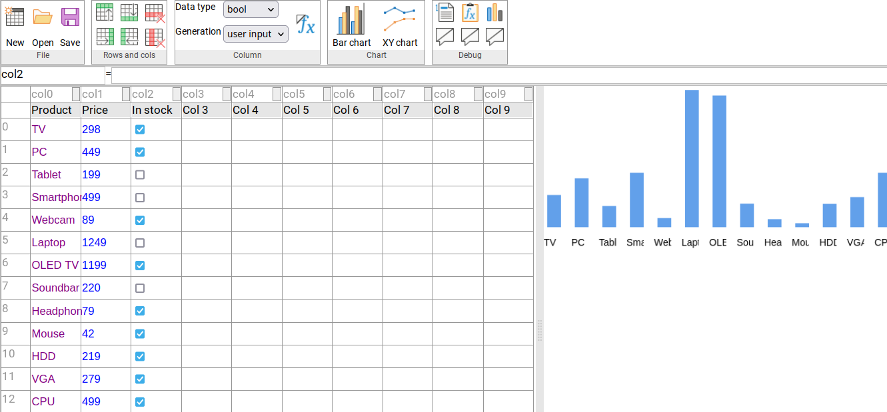

# Spreadsheet editor frontend
This is a homework project that recreates an website similar to Google Sheets, e.g. an online spreadsheet editor.

# Technologies used
- TypeScript
- Angular
- HTML, CSS
- Math.js - for evaluating formulas

The icons are Colibre icons from LibreOffice.

